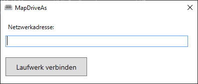

# MapDriveAs
Map a shared network drive with other login credentials via GUI or CLI.

# Usage
## GUI
When you launch the .exe, you will be prompted with the following GUI:


It allows you to map a network location as letter **"Y:"**
You must unmount it manually in the explorer or via the CLI.

## CLI
```
MapDriveAs.exe [command] [DriveLetter] [SharePath]
Commands: mount, unmount, toggle

Example:
MapDriveAs.exe mount "Y:" "\\filesrv.local\share"
MapDriveAs.exe unmount "Y:"
MapDriveAs.exe toggle "Y:" "\\filesrv.local\share"
```

### Command behaviour:
- `help` shows this help message.
- `mount` just mounts the share as the specified letter
- `unmount` unmounts a share connected as the specified letter
- `toggle` checks, if a share is mounted using this letter and unmounts it. When no share is connected, it mounts the specified network location.

This tool is intented to be used in combination with for example macro software from your keyboard or AutoHotkey to bind a key to a network share.


## Credits
* CredUiPromptForWindowsCredentials wrapper code [by Rubinsh on Stackoverflow](https://stackoverflow.com/a/4135720)
